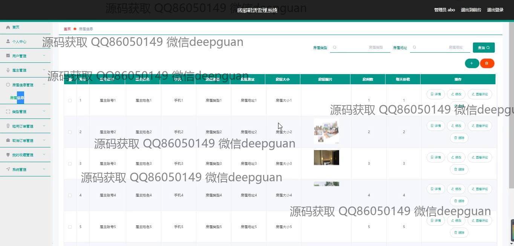

<h1 align="center">房屋租赁管理系统的设计与实现</h1>

## 简介
房屋租赁管理系统：角色分为管理员、房主、租客；功能包括用户管理、房屋信息管理、租赁订单管理、合同管理、个人中心及租赁公告，实现租赁流程高效管理和用户信息安全维护。    --计算机毕业设计源码；毕设源码；java毕业设计源码

## 联系方式

<h3 align="center">获取完整代码与数据库文件 + 微信：deepguan QQ: 86050149 QQ群: 783742310</h3>

<h3 align="center">可帮忙远程部署 包运行成功！提供远程部署、修改代码、设计文档指导、代码讲解等服务！</h3>

## 功能介绍（完整见运行截图）
管理员：基本功能包括系统登录、注册以及退出。管理员可以在后台管理系统中，查看和管理所有用户、房主资料以及系统中的房屋信息，还可以操作房屋类型、租赁订单和各种系统设置。个人中心提供了管理员账户的信息查看和更新。同时，管理员拥有权限管理功能，可对用户和房主的账号进行编辑和删除，并查看交易记录和订阅信息。

用户：用户具备登录、注册和退出功能。用户可以浏览网站首页，通过导航栏访问不同功能模块，如查看房屋信息、房屋租赁公告和个人中心。用户可以在个人中心修改个人信息、浏览和管理租赁订单，还能使用收藏功能保存感兴趣的房屋信息。此外，用户可以通过平台发布住宅租赁信息，管理自己的账号，查看网站的公告和房屋推荐信息。

房主：房主可进行注册并使用特定功能模块，包括录入和管理房屋信息、设置租赁价格和更新租赁状态。房主可以在个人中心查看和编辑个人资料，上传房屋图片和详细介绍，并使用预约和合同管理功能进行租赁过程的管理。系统提供的个人中心允许房主检索和管理其所登记的房屋信息，更新联系方式以及处理租客的预约订单。

租客：租客可以注册账号以访问系统，浏览房屋租赁信息并使用搜索和筛选功能来查找符合需求的房源。租客能查看每个房屋的详细信息，生成和管理租赁订单，并通过评论功能与房主交流。个人中心支持租客的基本信息查看和修改，允许租客管理已创建的订单以及浏览和管理收藏的房源。租客通过平台可享受简便的房屋租赁流程。

## 运行截图

本代码来源于网络,仅供学习参考使用!

